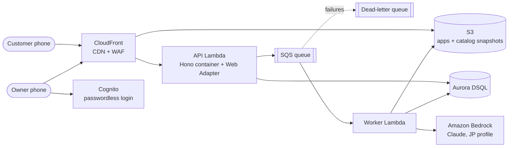
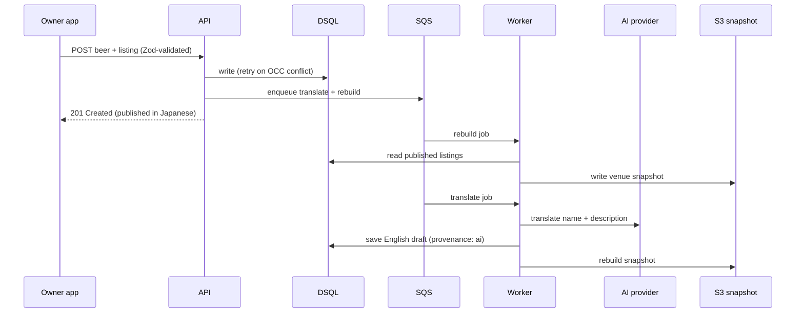

# Architecture

> Status: Step 5 complete. Decisions: ADRs 0010–0023. Delivery pipeline: [07-delivery-pipeline.md](07-delivery-pipeline.md).

## Principles

- **The read path never touches compute or the database.** Customers read published snapshots from S3 through CloudFront (ADR 0010).
- **No idle fixed costs** (ADR 0008): no VPC, NAT Gateway, load balancer, or always-on cluster (ADRs 0011, 0012).
- **AI never blocks publishing** (ADR 0006): AI work happens asynchronously in the worker.
- **One container image everywhere**: Lambda in production, Kubernetes in CI and demos (ADRs 0009, 0012).
- **No stored secrets**: every connection authenticates by identity (ADR 0023).

## System overview

## Components

| Component | Responsibility | ADR |
| --- | --- | --- |
| CloudFront | TLS, caching, WAF, routing `/api/*` to the API and everything else to S3 | 0010, 0012 |
| S3 | Static builds of the owner app and catalog; per-venue catalog snapshots | 0010 |
| API (Lambda) | Owner authentication, writes, validation, enqueueing jobs | 0012, 0013 |
| SQS + DLQ | Durable job queue for translation and snapshot rebuilds; failed jobs to DLQ with alarm | 0012 |
| Worker (Lambda) | Calls Bedrock, writes translations, builds and publishes snapshots | 0006, 0012, 0020 |
| Aurora DSQL | System of record; IAM-authenticated; three-AZ | 0011, 0014 |
| Amazon Bedrock | Claude translation via the Japan inference profile; IAM-authenticated | 0020 |
| Amazon Cognito | Owner sign-in (passkeys, email codes); issues tokens the API verifies | 0022 |
| CloudWatch, X-Ray, SNS | Logs, metrics, OpenTelemetry traces, alarms to email | 0021 |

## Key flows

### Journey 1: owner adds a beer

### Journey 2: customer browses

1. The catalog app (static) loads from CloudFront.
2. The app fetches the venue snapshot JSON (short `max-age`, `stale-while-revalidate`, `stale-if-error`).
3. All filtering happens in the browser; filter state is kept in the URL.

### Journey 3: stock update

The status change is a small write through the API, followed by a snapshot rebuild job. Target: visible to customers within 30 seconds (NFR 3).

## Environments

| Environment | Lifetime | Notes |
| --- | --- | --- |
| Local | Developer machine | Docker Compose: API container, PostgreSQL (DSQL-compatible subset), local S3/SQS stand-ins to be chosen |
| CI | Per pipeline run | Unit tests, local PostgreSQL, kind cluster for Kubernetes tests; integration stage against a DSQL dev cluster |
| Staging | Always on (ADR 0019) | Same modules as production; receives every merge to `main`; Playwright smoke tests after deploy |
| Production | Always on | Tokyo region |

## Open items for the walking skeleton (step 6)

- Local stand-ins for S3 and SQS
- Exact tool and library versions, linting and formatting tools
- DSQL compatibility of Drizzle and the migration runner (ADR 0014)
- OpenTelemetry wiring in the container image (ADR 0021)
- Bedrock model access and quotas in Tokyo (ADR 0020)
- Number of CloudFront flat-rate Free plans per account (ADR 0019)
- Cognito email requirements for passwordless codes; SES production access (ADR 0022)
