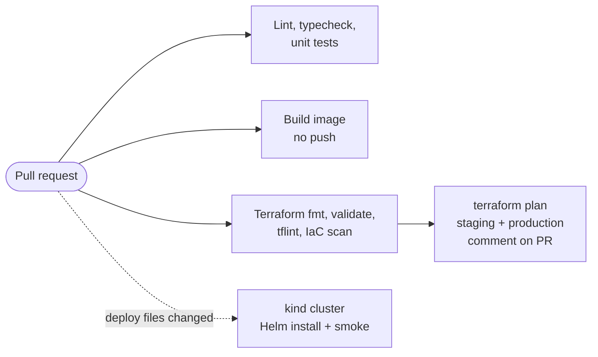
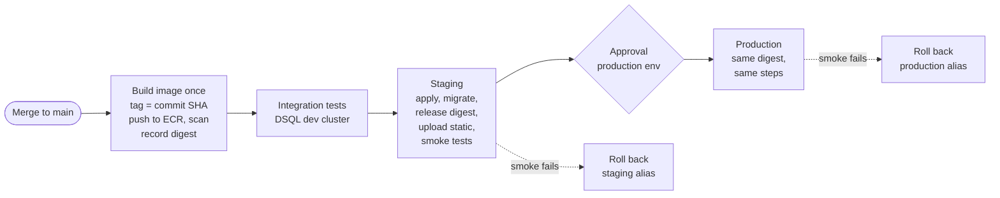

# Delivery Pipeline

> Status: Designed (step 5, round 3a). Decisions: ADRs 0015–0019. Versions are pinned during the walking skeleton after checking current releases.

## Principles

1. **Build once, promote the same artifact.** The image digest tested in staging is the digest released to production.
2. **No long-lived credentials.** GitHub Actions authenticates to AWS through OIDC; no access keys are stored anywhere.
3. **Least privilege per stage.** Pull-request jobs can only read; staging and production deploys use separate roles.
4. **Every change goes through a pull request**, including infrastructure. Terraform plans are visible in the PR before apply.
5. **Fast feedback first.** Cheap checks run before slow ones.
6. **Every release can be undone in seconds**, and failed smoke tests undo it automatically.

## Repository settings

- Public repository on GitHub Free (standard hosted runners are free for public repos; environments and required reviewers are available for public repos on Free).
- Branch ruleset on `main`: pull request required, required status checks, no force pushes, no direct pushes.
- GitHub environments: `staging` (deploys from `main` only) and `production` (deploys from `main` only, required reviewer: repository owner).
- Workflows never run untrusted pull-request code with write permissions or AWS roles (no `pull_request_target` checkouts of PR code).

## AWS roles (OIDC)

| Role | Trusted subject | Permissions |
| --- | --- | --- |
| `ci-plan` | Pull-request runs from this repository | Read-only on managed resources; read Terraform state |
| `deploy-staging` | Jobs in the `staging` environment | Apply staging Terraform, push to ECR, release to staging Lambda, upload staging static assets, run migrations |
| `deploy-production` | Jobs in the `production` environment | Same as staging, production resources only |

Trust policies match the **immutable subject format** used by repositories created after 2026-07-15, for example `repo:<owner>@<owner_id>/<repo>@<repo_id>:environment:production`. Look up IDs with `gh api repos/<owner>/<repo> --jq '{owner_id: .owner.id, repo_id: .id}'`. See ADR 0016.

## Pull-request workflow

Read-only, no deploys. All jobs are required checks.



## Main workflow



- Concurrency groups per environment: two deploys to the same environment never overlap.
- ECR tags are immutable; releases reference image **digests**, not tags.

## Release and rollback

1. Terraform owns infrastructure, including the Lambda functions; it ignores changes to the function image (ADR 0018).
2. The release script points the function at the new image digest, publishes a new Lambda version, runs smoke tests against that version, then moves the `live` alias to it.
3. Static assets are uploaded with content-hashed file names first, and `index.html` last, so users never load a page referencing missing assets.
4. Rollback: move the `live` alias back to the previous version (seconds). Static assets roll back by re-uploading the previous `index.html`.
5. Database migrations follow expand/contract (ADR 0014), so the previous release keeps working after a migration.

## Supply-chain hardening

- Every third-party action pinned to a full commit SHA; Dependabot updates the pins. (Motivating incident: on 2026-03-19, 76 of 77 version tags of `aquasecurity/trivy-action` were force-pushed to credential-stealing code; SHA-pinned workflows were not affected. CVE-2026-33634.)
- Minimal `permissions:` per job; `id-token: write` only on jobs that assume AWS roles.
- pnpm minimum release age for dependencies (ADR 0013); lockfile committed.
- Container images scanned on push; Terraform scanned on every pull request.
- Stretch goal: build provenance attestations for container images.

## Terraform layout

```
infra/
  bootstrap/        # applied once by hand: state bucket, GitHub OIDC provider, CI roles
  modules/
    static-site/    # S3 + CloudFront
    api/            # ECR + API Lambda
    worker/         # SQS + DLQ + worker Lambda
    database/       # Aurora DSQL + AWS Backup plan
    observability/  # alarms, dashboards, budgets
  envs/
    staging/
    production/
```

See ADR 0017.

## Stretch goals

- Per-pull-request preview environments (cheap with the serverless architecture).
- Canary releases (shift a percentage of traffic via weighted Lambda aliases).
- Build provenance attestations.
